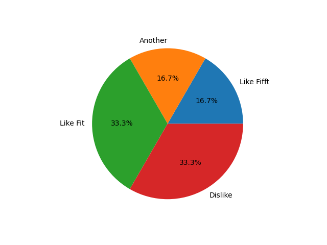

<h1>RU</h1>

<h3>Бот опросник</h3>

Telegram бот -Python 3.9 Telebot/MatPotLib 

<ul> 
Библиотеки

  <li>Telebot</li>
  <li>MatPotLib</li>
</ul>

 Бот собирает информацию с пользователей. Администратор может получать данные в виде диаграмм. 
 

 
 
<h1>EN</h1>

<h3>Poll bot</h3>

Telegram bot -Python 3.9 Telebot/MatPotLib 

<ul> 
Libraries

  <li>Telebot</li>
  <li>MatPotLib</li>
</ul>

 Bot collect information from users. Admin can get information as diagram. 
 

